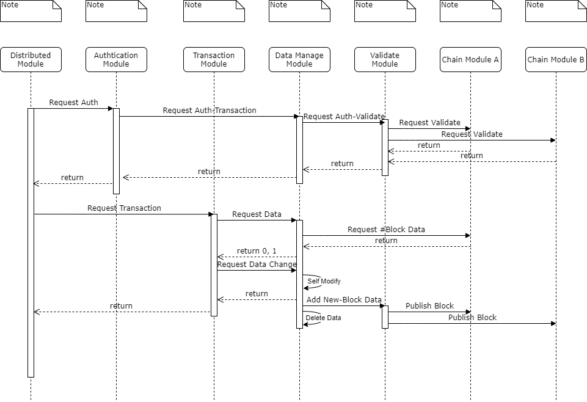

# Hybrid One-Chain

## Committer
- Preparing...

## Information
- Version : 0.1v
- Create Date : 2021.03.19
- Upgate Date : 2021.04.01
- Version Upgrade Date : 2021.
- Recommand Python Version : 3.9.4

## Goal
- Performance of new Oauth
- Efficiency of data management

## Require Environment
```
pip install fastapi
pip install uvicorn
pip install Jinja2
pip install pycryptodome
```

## Code Format
``` Unknown ```

## UML


## Operation
- Response index
- Basic login function
- Create authchain